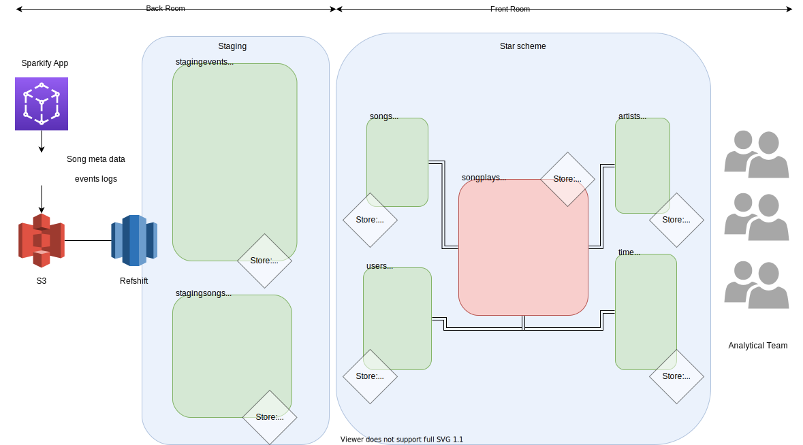

# Sparkify Data Warehouse on AWS Redshift

-Note this is a hypothetical enterprise that was built for the Nano Degree in 
Data Engineering. Udacity.


## Context
Sparkify is a start-up that runs a streaming music service. We already designed
the relational database model using the **star scheme** on **postgresql**. 
The repository with the context can be found in
[here](https://github.com/gariciodaro/postgresql-Sparkify-data-modeling). 
However, Sparkify is blooming, not only they have a massive increase
on users, but they had also increased the data analysis team. Since 
postgresql can only be **scaled up** (increase the power of a single 
server) they soon are going to reach physical capacity, what is more, 
since the data analysis team is bigger, and not query consensus is yet 
possible, high availability is becoming increasingly important (we need 
parallel processing). Recall that postgresql offers ACID transaction 
support so that reading might be slow on high volumes of data. 
We conducted a pilot with a **cassandra** 
Nosql( see [here](http://garisplace.com/udacity/cassandra_project.html) ),
which solved the storage capacity problem, as well as the highly Availity 
problem, however, the business team found it hard to understand the 
new model, which is query-based, to make matters worst, since there is 
still no query consensus, some employees complained saying things 
like "the new model cuts on creativity", or "where did my freedom go?". 

In this scenario, AWS offers a good solution. It can keep the start 
scheme on Redshift while solving the data storage problem with S3, additionally,
since Redshift is a massively parallel processing database, it also ensures 
availability for the businesses analytic team. 

We implemented a **Kimbal 's bus architecture** data warehouse on Redshift 
to solve all the explained problems.

<div>

</div>

## Folder Structure

```
├── awsUtils
│   ├── 1_createIAM.py
│   ├── 2_redshiftCluster.py
│   ├── 3_checkRShifCluster.py
│   ├── 4_openPortsRShifCluster.py
│   └── configuration
│       └── redshift.cfg
├── create_tables.py
├── datawarehouse.svg
├── dwh.cfg
├── etl.py
├── README.md
└── sql_queries.py
```
## Files
+ ```sql_queries.py:```  Set of functions to create queries for, create, drop, insert tables on Amazon redshift.
+ ```create_tables.py:```  Set of functions to connect to AWS redshift execute create and drop statement defined in sql_queries.py
+ ```etl.py:``` Set of functions to connect to AWS redshift. Loads data from S3, staging it in redshift. Execute insert statement defined in sql_queries.py
+ ```datawarehouse.svg:``` diagram of the Data warehouse.
+ ```dwh.cfg:``` Data warehouse configuration.
+ ```./data/awsUtils```
  + ```1_createIAM.py:``` Create an IAM role on AWS to grand access to Redshift instances on your behalf. Attach the policy to read-only to S3 services.
  + ```2_redshiftCluster.py:``` Create or Erase a redshift instance on AWS. Example of infrastructure as code.
  + ```3_checkRShifCluster.py:``` check the state of Redshift cluster. If active returns the endpoint and ARN.
  + ```4_openPortsRShifCluster.py:``` open ports of RedShift for TCP connections.
  + ```redshift.cfg``` redshift cluster creation and security roles configurations.

## Usage
Pass your AWS credentials to ```redshift.cfg```. Run the scripts in ```./data/awsUtils``` sequentially. On ```2_redshiftCluster.py:``` pass the ``` --action create```. Once the Redshift cluster
is ready (use ```3_checkRShifCluster.py:```) change ```dwh.cfg``` file accordingly. Execute ```create_tables.py```, and then ```etl.py```.  